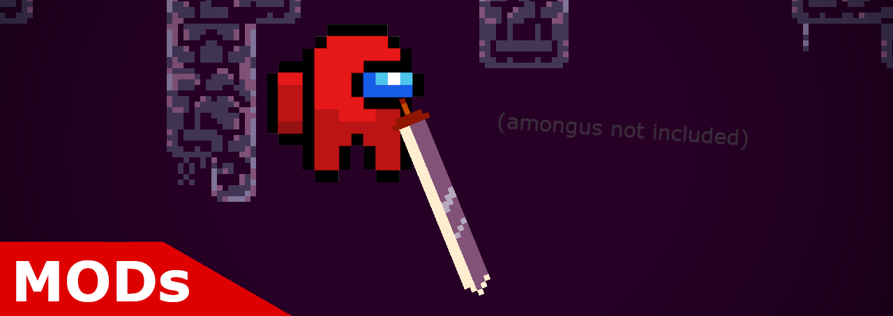

Small mods I've made for Deepest Sword that aren't big enough to be their own repo.
  

# Installing the mods
First, you can download the BepInEx mod loader [here](https://github.com/BepInEx/BepInEx/releases/latest).
  
After you downloaded it, extract everything in it's zip file into the directory that has the Deepest Sword `.exe` file *(it's usually `C:\Program Files (x86)\Steam\steamapps\common\Deepest Sword\`)* 
After that, you should run the game once to initialize BepInEx.
  
Second, you can download one or more of my mods from the [release](https://github.com/FlooferLand/DeepestSwordMods/tags) page. 
Then you can drag the mod(s) into `..\Deepest Sword\BepInEx\plugins\`
  
You should be able to run the game now! 

# Building the projects
1. Install [Visual Studio 2022](https://visualstudio.microsoft.com/) with the ".NET Desktop Development" package. 
2. Download and extract, or clone this repository.
3. Open up the directory of the mod you want to change *(same directory as the .sln file)*, and make a `BuildVars` directory. 
4. In the `BuildVars` directory make a text file called `deepest_sword_path.txt` and paste in the path to the directory you installed Deepest Sword in.
5. In the `lib` directory, paste in the following things: 
    * All the DLLs in `..\Deepest Sword\BepInEx\Core` (besides `Harmony20.dll`).
    * From `..\Deepest Sword\Deepest Sword_Data\Managed`, the following DLLs:
        1. `Assembly-CSharp.dll`
        2. `Cinemachine.dll`
    * After that, you can download and extract [NStrip](https://github.com/BepInEx/NStrip/releases/latest) and put the `NStrip.exe` in the `lib` directory. Then from the terminal CD into the `lib` directory and run: 
    `.\NStrip -p -cg --cg-exclude-events --remove-readonly Assembly-CSharp.dll Assembly-CSharp-nstrip.dll`.

Now you should be able to open the `.sln` file of the mod you want to modify/contribute to!
  
I'd also recommend you use the [UnityExplorer](https://github.com/sinai-dev/UnityExplorer/releases/latest) mod for development, as it helps you look around the game scenes and modify the game in real-time.